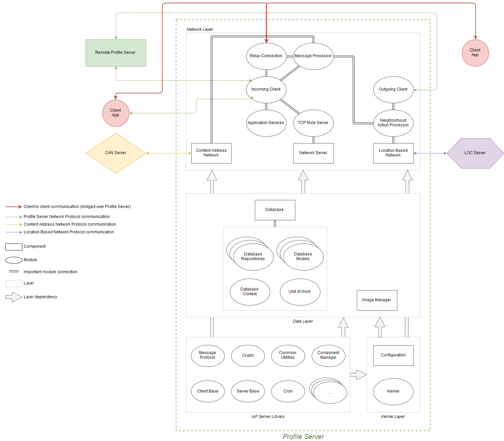

# Profile Server Component Layers

Each of the profile server's components belong to one of the four layers - kernel layer, data layer, network layer, and utility layer.
In the profile server's design a *component* is a special module that is controlled by the component manager and has a controlled life cycle. 

## Kernel Layer

Kernel layer contains the following:

 * Modules that define component structure and implement component life cycle management.
 * Configuration component that loads and stores the profile server configuration from the configuration file.
 * Cron component that is responsible for running repeated tasks.

## Data Layer

Profile server stores all of its data to a database, except for images of identity profiles that are stored in separate files on disk. 
Data layer contains:

 * Modules related to the database access and its structure.
 * Database component that is responsible for initialization of the database during the startup and database cleanup tasks.
 * Image manager component that cares about loading and storing images as well as image processing.

## Network Layer

The largest layer in profile server is the network layer, it consists of the following components and modules:

 * Network server component that manages all running TCP role servers.
 * TCP role server module that represents a single open port which offers services of one or more profile server's interfaces.
 * Incoming client module that represents an incoming TCP connection to the TCP role server.
 * Message processor module that processes messages from incoming clients.
 * Location based network component that implements communication with Location Based Network server.
 * Content address network component that implements communication with Content Address Network server.
 * Neighborhood action processor component which is responsible for handling events related to profile server neighborhood interactions.
 * Other network related modules, such as modules representing outgoing network clients, modules related to application service calls functionality etc.

## Utility Layer

Utility layer consists of a bunch of helper modules that are used by different components across the layers.
Any module that does not fit into the first three layers goes here. Examples of components in the utility layer 
are modules related to logging, regular expression evaluation module, helper file handling module, extension classes module etc.

---
*Components and Layers (click on the image and then click Download to see it in full size)*

---
[Profile Server Fundamentals](ARCH-PS-Fundamentals.md) « [Index](ARCHITECTURE.md) » [Profile Server Kernel Layer](ARCH-PS-Kernel-Layer.md)
